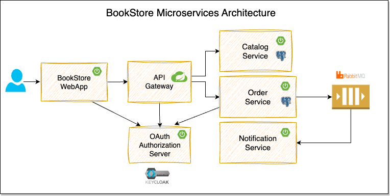

# BOOKSTORE MICROSERVICES

## Billy Chan

[4d256519-9fe5-4357-8312-16268888a42e.webm](https://github.com/user-attachments/assets/0aa0ad3c-b058-41b0-b38b-0f09b157ae89)

## Modules
* **catalog-service**:
  This services provides REST API for managing catalog of products(books).

  **TechStack:** Spring Boot, Spring Data JPA, PostgreSQL

* **order-service**:
  This service provides the REST API for managing orders and publishes order events to the message broker.

  **TechStack:** Spring Boot, Spring Security OAuth2, Keycloak, Spring Data JPA, PostgreSQL, RabbitMQ

* **notification-service**:
  This service listens to the order events and sends notifications to the users.

  **TechStack:** Spring Boot, RabbitMQ

* **api-gateway**:
  This service is an API Gateway to the internal backend services (catalog-service, order-service).

  **TechStack:** Spring Boot, Spring Cloud Gateway

* **bookstore-webapp**:
  This is the customer facing web application where customers can browse the catalog, place orders, and view their order details.

  **TechStack:** Spring Boot, Spring Security OAuth2, Keycloak, Thymeleaf, Alpine.js, Bootstrap